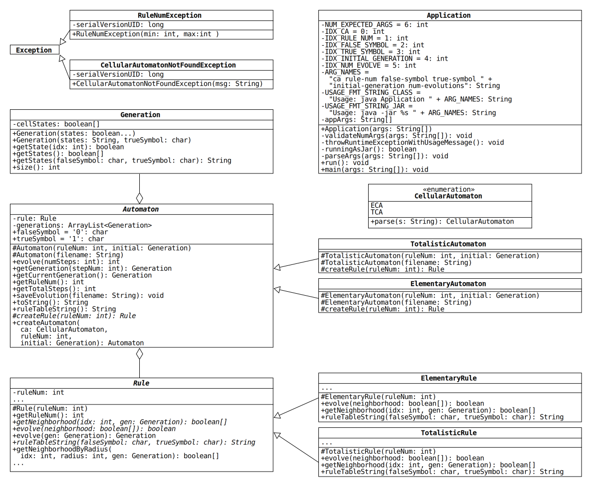

# Project 2: Not-So-Elementary Cellular Automata

## Overview

A UML diagram of the classes is shown below.
To view a larger version, open the file [uml.pdf](./uml.pdf) in a PDF reader.



Automaton uses an ArrayList of Generations and a Rule to simulate a one-dimensional (1D), two-state cellular automaton (CA).

The console will ask for one of the following inputs

1. `ca`: The type of cellular automaton, ECA or TCA.
2. `rule-num`: An integer value representing a rule number.
3. `false-symbol`: A character representing the false symbol.
4. `true-symbol`: A character representing the true symbol.
5. `initial-generation`: A string representation of the initial generation.
6. `num-evolutions`: Number of generations to evolve by.

You then enter a rule, your false symbol, your true symbol, then an initial generation followed by the number of evolutions you would like to show.

For instance,

```console
$ java Application tca 22 0 1 0001000 3
0001000
0111110
0010100
1111111
```

